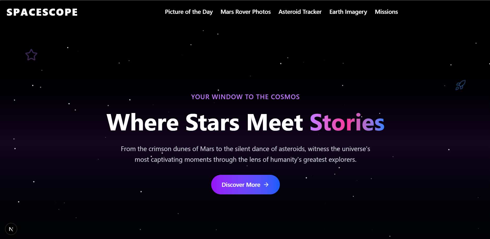
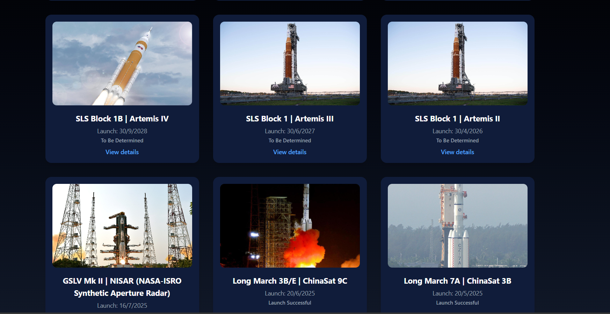
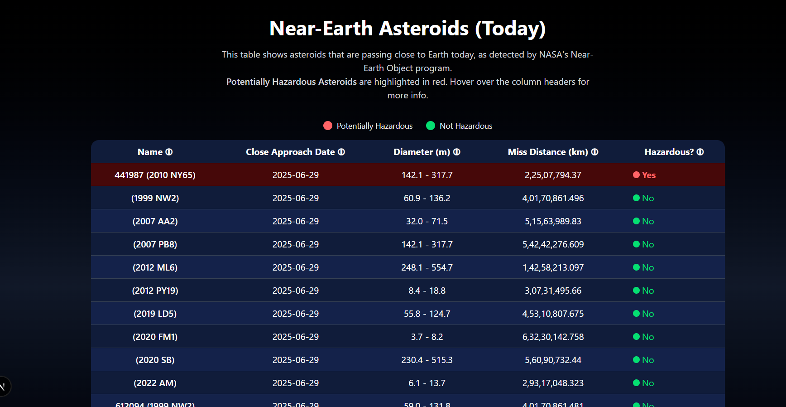
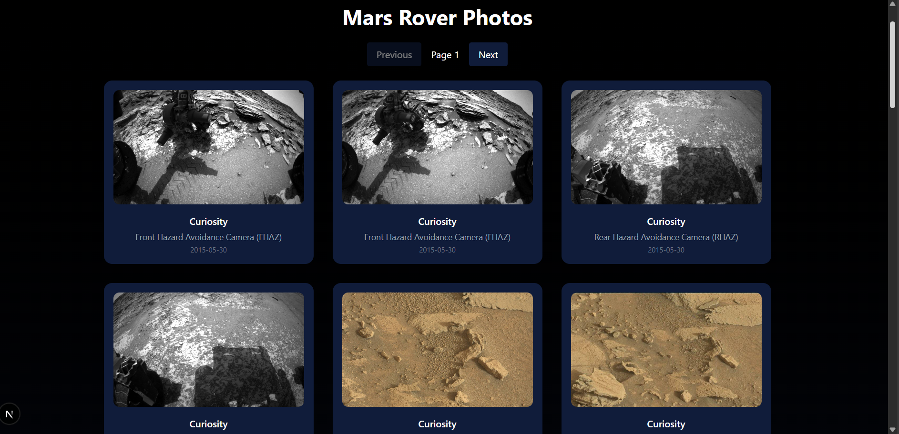
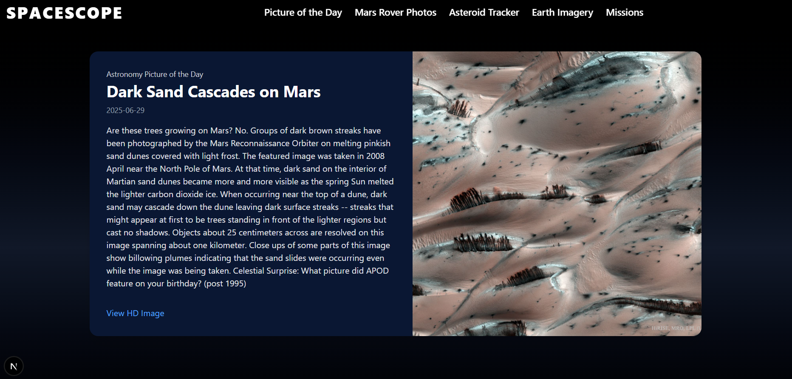
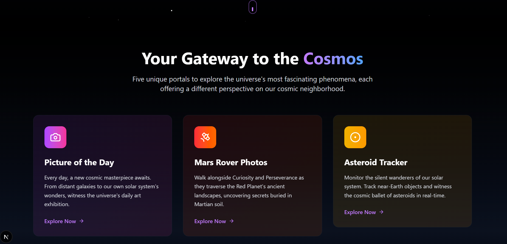

# SPACESCOPE

SPACESCOPE is a visually immersive web application that brings the wonders of space exploration to your fingertips. This project was developed with the assistance of **Cursor AI** to streamline and enhance the development process.

---

## Landing Page & Hero Section

The landing page welcomes users with a dynamic, animated hero section. It features a cosmic background, a bold headline, and a prominent "Discover More" button. This section sets the tone for the entire application, inviting users to begin their journey through the cosmos.

---

## Missions Gallery

The missions gallery showcases a collection of current and upcoming space missions. Each card displays a mission image, title, launch date, and status, providing a quick overview of humanity's ongoing efforts to explore beyond Earth.

---

## Astronomy Picture of the Day (APOD)

This section highlights NASA's Astronomy Picture of the Day, featuring a stunning space image or video along with a brief description. It offers users a daily dose of cosmic inspiration and knowledge.

---

## Near-Earth Asteroids Table

A detailed table presents information about asteroids passing close to Earth. Users can view names, approach dates, diameters, distances, and hazard status, making it easy to understand the scale and proximity of these celestial objects.

---

## Mars Rover Photos

This gallery displays recent photos captured by Mars rovers. Each card includes the rover's name, camera type, and the date the photo was taken, allowing users to explore the Martian surface through the eyes of robotic explorers.

---

## Full APOD Detail View

A dedicated section provides an in-depth look at the Astronomy Picture of the Day, including the full image, detailed explanation, and additional context about the featured astronomical phenomenon.

---

## Features Overview

The features section introduces users to the five main areas of the application: Picture of the Day, Mars Rover Photos, Asteroid Tracker, Earth Imagery, and Missions. Each feature card is interactive and visually distinct, guiding users to explore further.

---

## Technology & Development
- Built with Next.js and React for a modern, responsive experience.
- Utilizes NASA and Space Devs public APIs for real-time space data.
- Designed and iterated with the help of **Cursor AI** for efficient, AI-powered development.

---

SPACESCOPE offers a seamless and engaging way to explore the universe, combining beautiful visuals, real-time data, and intuitive navigation. Enjoy your journey through the cosmos!
